# CASIO PV-1000 EMULATOR

A minimal Casio PV-1000 Emulator. It supports all the 13 released games.

## How to use

to run the emulator executes this from command line:
```pv1000.exe <rom path>```
Or you can just drag and drop your rom into the executable file.

## Controls

| PC | PV-1000 |
|----|--------|
| ARROW KEYS | DPAD |
| A | BUTTON 1 |
| S | BUTTON 2 |
| Z | SELECT |  
| X | START |

## Hardware documentation

Since the Casio PV-1000 is not well documented, I tried to gather all the scattered information into a unique [website](https://yughias.github.io/pages/pv-1000/documentation/docs.html).

## Demo

You can try a demo of the emulator [here](https://yughias.github.io/pages/pv-1000/emulator/emulator.html).

## Screenshots

| 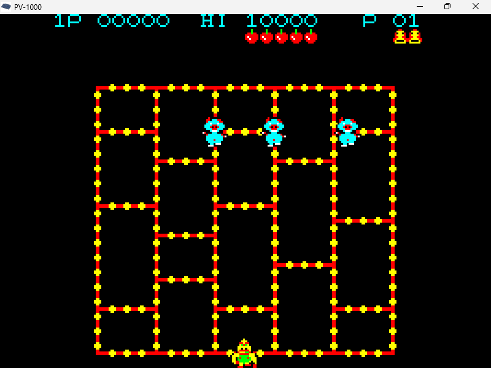 | 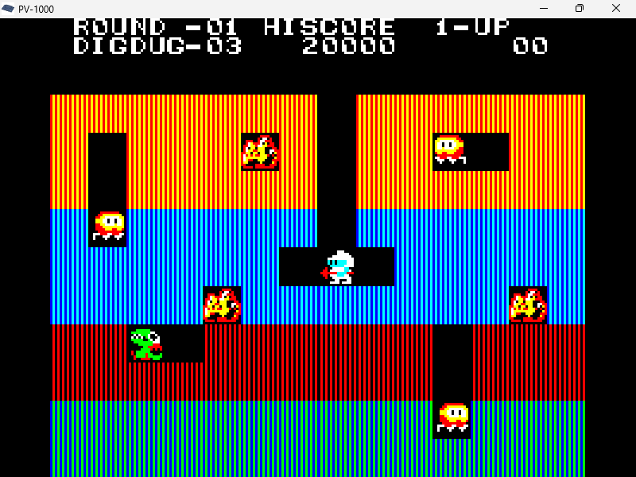 | 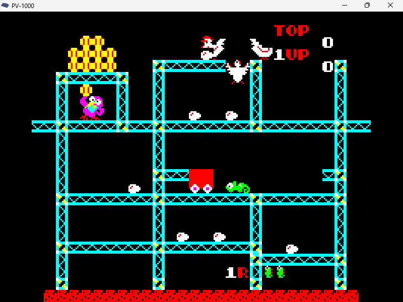 |
| - | - | - |
| 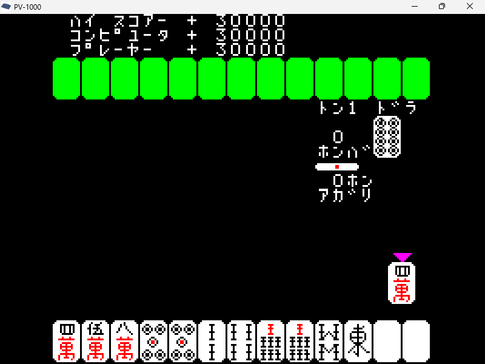 | 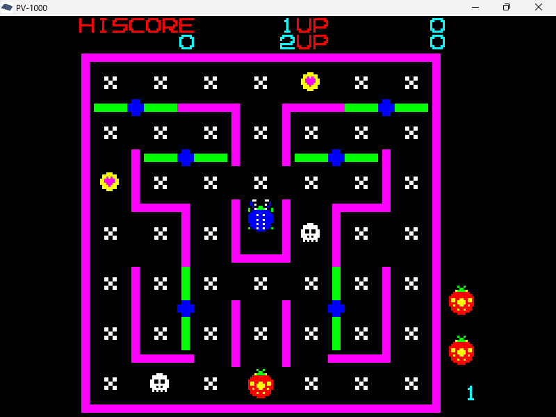 | 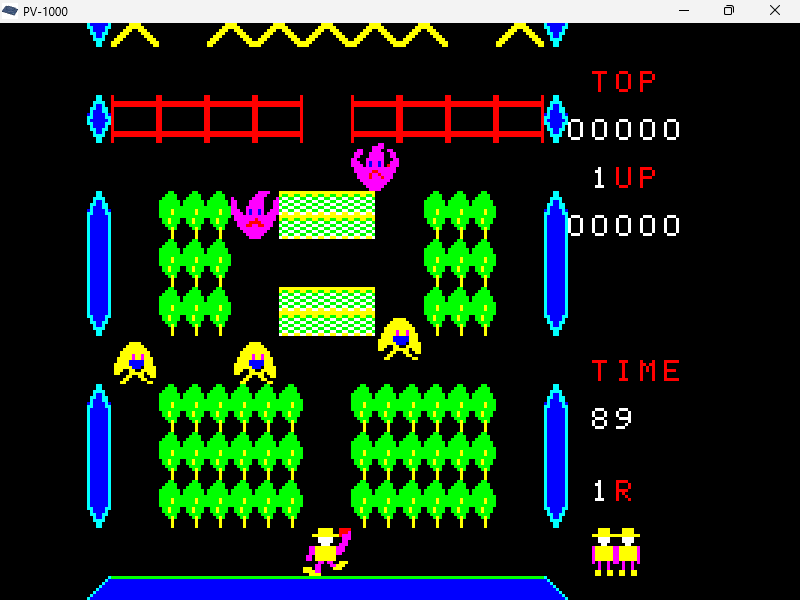 |
| 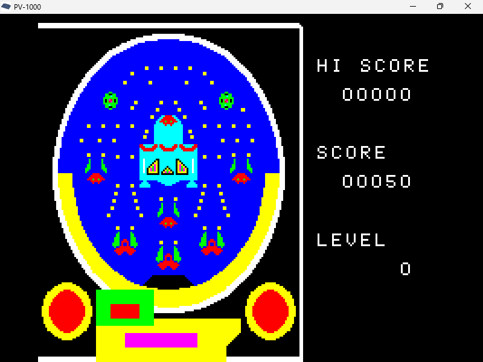 | 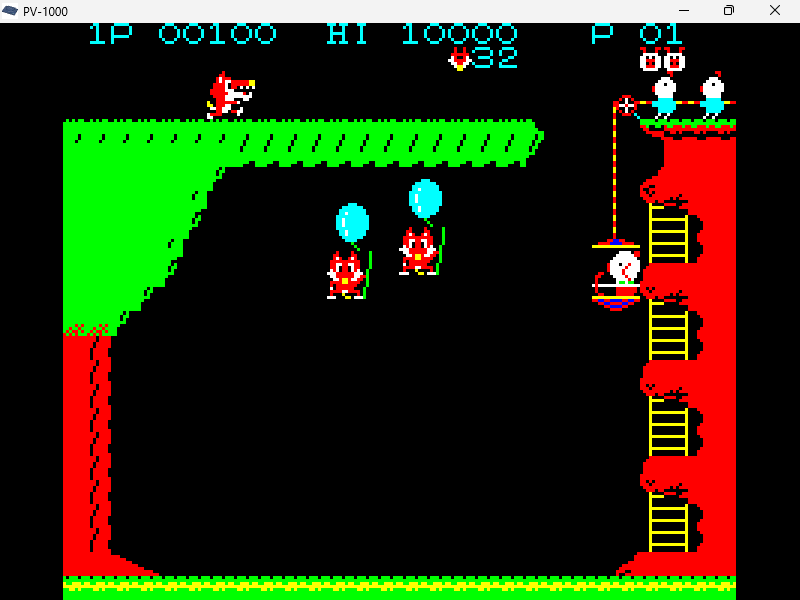 | 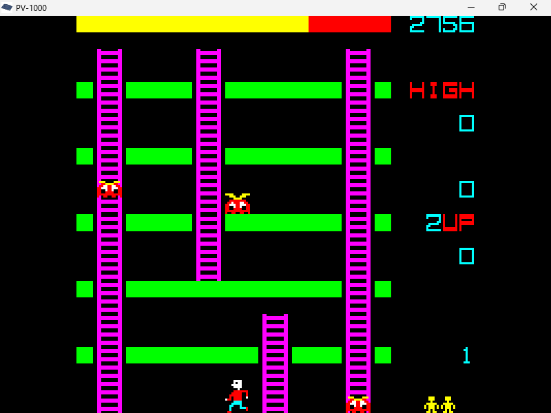 |
| 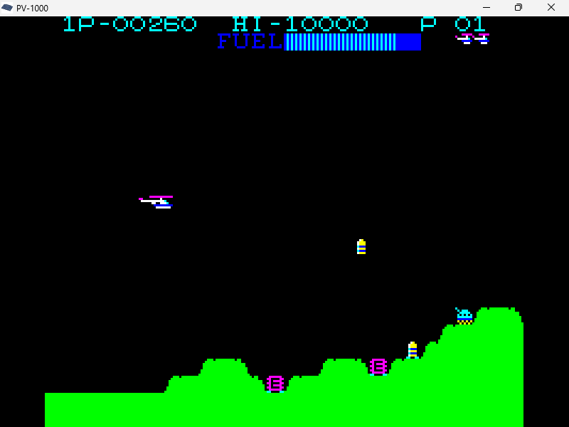 | 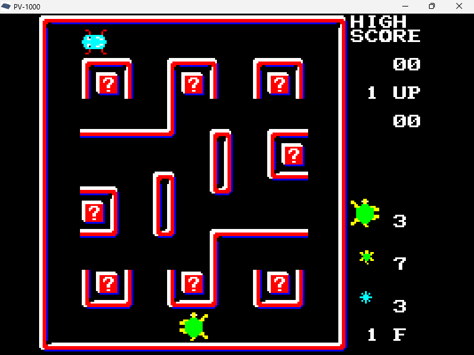 | 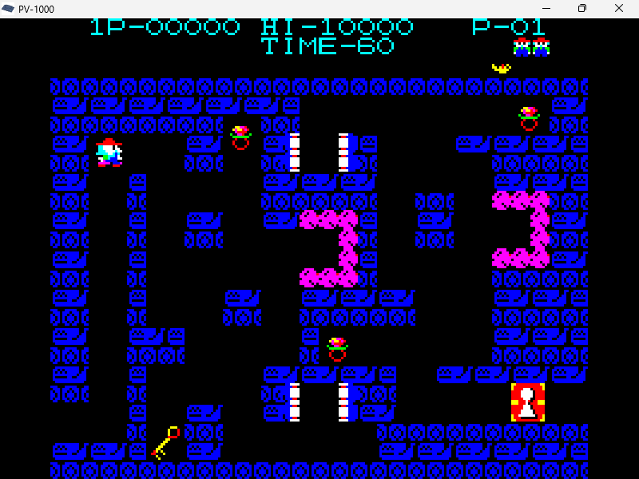 |
| | 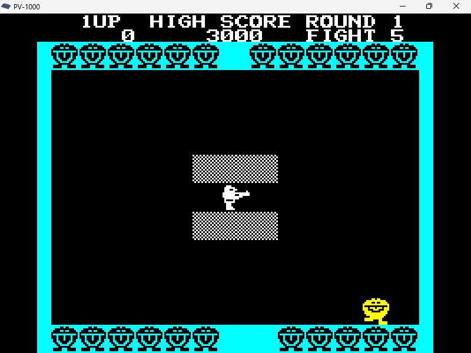 |  |